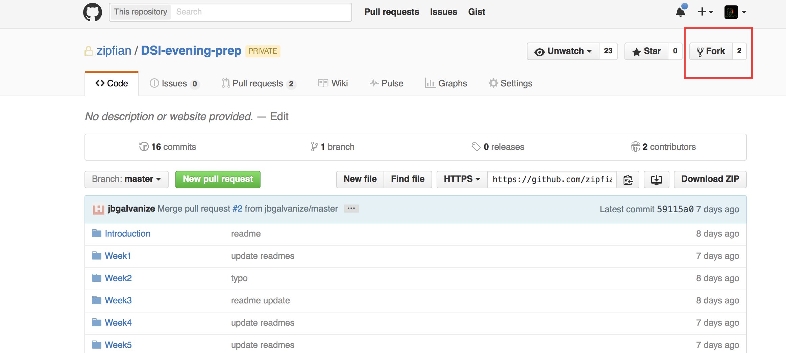
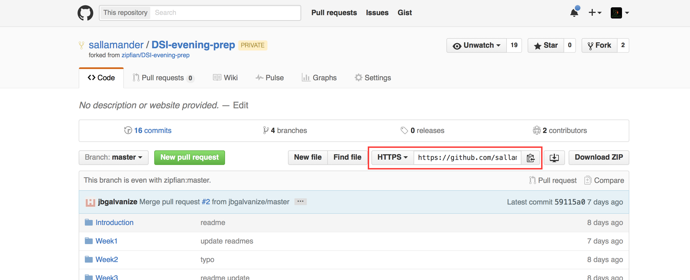

# Practicing with Git and Github

This assignment will walk you through forking the repository for this
program, cloning your forked copy to your local machine, and some of the
Git commands discussed in lecture. Similar to the Unix assignment, this
assignment will be fairly brief, as familiarity with Git and Github will
come over time as you interact with them more and more.

1.) Open up your browser and navigate to this program's repository on
[Github](https://github.com/gschool/dsi-python-fundamentals).

2.) Fork this repository, making sure to fork it to your Github
account (usually it forks to your Github account by default, so if you're not
prompted, then you should be fine). The button to `Fork` should be up in the
top right of the page:

3.) Now navigate to your own Github repository, and grab the URL for your
fork so that you can clone it to your local machine. You should be able
to find the URL in the top middle of the page:

4.) In the terminal on your local, use the URL you just copied to clone
your Fork of this program's repository. Make sure that you are in a directory
where you are okay storing this repository.

5.) Navigate into the repository, and create a file called `test_git_file.txt`.
This will require some of the Unix commands that we have previously discussed.

6.) Add this file to the `.git` index (we're now back to using Git commands).

7.) Commit this file, and then push it to your forked copy of the repository
on Github. Navigate to your forked version of the repository on Github, and
check to make sure that the `test_git_file.txt` is present there.

8.) Back in your terminal on your local, remove `test_git_file.txt` from
the repository.

9.) Add, commit, and push this change.

10.) Navigate back to your forked version of the repository on Github, where
you should see that the `test_git_file.txt` is no longer there.

# GitHub Homework

1.) Populate your GitHub profile. Add your name, a photo, your info, etc.

2.) Create 3 GitHub repositories for your three "dream" projects.

3.) Clone your three GitHub repos onto your local computer.

4.) Write a short README.md file for each project. Each README.md file should be written in Markdown so that it renders beautifully on GitHub.com. If you are new to writing Markdown, do this [Markdown Tutorial](http://www.markdowntutorial.com/).
