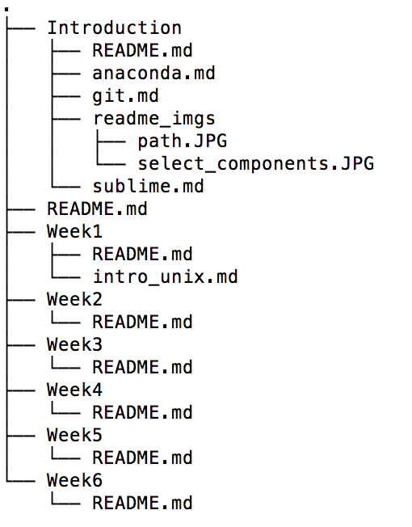

# Intro to Unix

## Background

Unix is a multitasking, multiuser computer operating system. Today, most
computers are either built on top of a unix operating system or Microsoft
Windows. There are a number of differences between them, but the major
difference is that Unix is open-source, which means that anybody and everybody
has access to the source code behind it (this isn't true for Windows).

There are a number of different distributions/flavors of Unix. Two of the
most popular are Mac OS and Linux. While different distributions of Unix will
have programs that are unique to that distribution, a very large percentage
of the programs in each Unix distribution will be the same. Today we're going
to be working with some of the programs that are common across all
distributions.

### Diving in

One thing to note before actually getting to Unix commands is that
these **commands** are the programs referred to in the background
section. Technically speaking, each one of these commands is actually a small
little program that somebody has built.

#### Navigation

In terms of navigation, the following three commands are going to be your
bread and butter:

* `pwd` - Stands for `print working directory`; this will write the full
  pathname of the current working directory to the terminal
* `cd` - Stands for `change directory`; this will allow you to navigate between
  different folders/directories in your directory structure
* `ls` - Stands for `list`; this will list the files in the current working
  directory

Let's walk through these in a little more detail.

1.) `pwd` is fairly straightforward, but in talking about pathnames it's
important to talk about the Unix filesystem tree and to make the
distinction between absolute and relative pathnames. In a Unix-based
operating system, files are organized in a tree-like pattern. The top
directory in a filesystem is called the *root directory*, which contains
files as well as subdirectories, which contain more files and
subdirectories, and so on. If we were to look at the file structure of the
repository for this class, we might see something like this:



Note that the terms directory and subdirectory are synonymous with the term folder. Also note that this picture above was taken when most of the folders were only populated with README.md files, which is why that's all you see in each one of the weekly folders.

When discussing the pathname of a file or subdirectory, we need to note
whether it is an absolute path or a relative path:

* An **absolute pathname** begins with the root directory and follows
  the filesystem tree branch by branch from the root directory. These
  will always begin with a forward slash `/`.

* A **relative pathname** begins with the current working directory
  and follows the filesystem tree branch by branch from the current
  working directory. These will not begin with a forward slash `/`.  

This distinction often doesn't come into play, but there are times where
programs expect an absolute pathname, in which case you need to make sure
to start from the root directory when passing the pathname to the program.

2.) `cd` allows you to change from one directory to another by simply placing
the name of the directory you want to go to after the `cd` command. `cd`
accepts a relative pathname or an absolute pathname, but if you pass it a
relative pathname, then that pathname has to be accessible via the current
working directory.

Assuming that the repo for this class is located at the path
`/Users/sallamander/galvanize/DSI-evening-prep`, then I can change to it
via the following:

```bash
cd galvanize/DSI-evening-prep # To use the cd command in this way,
                              # /Users/sallamander must be my current
                              # directory.
cd /Users/sallamander/galvanize/DSI-evening-prep # This will work from
                                                 # any current directory.
```

Some special ways of using the `cd` command involve the following:

```bash
cd ~ # Change directories to your home directory.
cd  # Another way to change directories to your home directory. 
cd .. # Change directory to the directory right above the current directory.
```

3.) `ls` allows you to list the files in the current directory or any
directory placed after the `ls` command. Similar to the `cd` command,
`ls` accepts a relative pathname or an absolute pathname, but if you pass
it a relative pathname, then that pathname has to be accessible via the
current working directory.

Assuming that I am in the `galvanize/DSI-evening-prep` folder, I can
issue the following commands:

```bash
ls # List all of the files and directories in galvanize/DSI-evening-prep
ls Introduction # List all of the files and directories in
                # galvanize/DSI-evening-prep/Introduction
ls /Users/sallamander/galvanize/DSI-evening-prep/Introduction # Same thing as
                                                              # ls Introduction
                                                              # above
```

#### Creating and Removing files

In terms of creating and removing files, the following commands are used:

* `touch` - create a file/change the timestamp on an already existent file
* `rm` - remove/delete a file

1.) In its default usage, `touch` is a command that will open and close a file
while leaving its contents unchanged. The end result is that it changes
the access timestamp associated with the file. However, if we use `touch`
with a non-existent file(s), then the end result will be that the file(s)
is created.

```bash
touch already_existent.txt # Assuming already_existent.txt is an existing
                           # file, then this changes the timestamp on it.
touch new_file1.txt # Assuming new_file1.txt doesn't exist, this creates a
                    # file named new_file1.txt in the current directory.
touch new_file2.txt new_file3.txt # Assuming that both new_file2.txt and
                                  # new_file3.txt don't exist, this creates
                                  # them in the current working directory.
```

2.) `rm` is a command that allows us to delete files by simply placing the
name of the file(s) to delete after the `rm` command.

```bash
rm file1.txt # Delete file1.txt
rm file2.txt file3.txt # Delete both file2.txt and file3.txt
```

**Note**: The results of the `rm` command are permanent, so **be careful**
when using it.

#### Creating and Removing Directories

In terms of creating and removing directories, the following commands are used:

* `mkdir` - create a directory
* `rmdir` - remove a Directory

1.) `mkdir` allows us to create a new directory(s) simply by placing the name of our newly created directory(s) right after the `mkdir` command:

```bash
mkdir new_dir1 # Create new directory called new_dir1 in the current directory
mkdir new_dir2 new_dir3 # Create new directories called new_dir2 and new_dir3
                        # in the current directory.
```

2.) `rmdir` allows us to delete an **empty** directory by placing the name of
the directory to delete right after the `rmdir` command:

```bash
rmdir empty_dir # Delete the empty directory called empty_dir
```

If the directory we want to delete is not empty, and **we are sure**
that we want to delete it, then we can add a **recursive** option to the
`rm` command from above:

```bash
rm -r nonempty_dir # Recursively deletes all files in the nonempty_dir,
                   # and then deletes the nonempty_dir itself.
```

#### Moving files and Directories

The two commands that we use to move files and directories around are:

* `cp` - copy files and directories
* `mv` - move and rename files and directories

1.) `cp` allows us to copy a file or directory from one location to another.
It takes two arguments - the name of the file or directory to copy, and
the name of the file or directory to copy it to (i.e. from location and
to location). If we are copying a directory, we have to add the `-r`
recursive option to the `cp` command.

```bash
cp file1.txt file2.txt # Copy file1.txt to a new file called file2.txt
cp file1.txt directory1 # Copy file1.txt to directory1, keeping it named
                        # as file1.txt within directory1.
cp file1.txt directory1/file11.txt # Copy file1.txt to directory1, but
                                   # name the copy file11.txt.
cp -r dir1 dir2 # Copy dir1 and all its concents into dir2.  
```

2.) `mv` allows us to move and rename a file or directory (getting rid of the original). Similar to the `cp` command, it takes two arguments - the name of the file or directory to move or rename, and the name of the file or directory to move it or rename it to.

```bash
mv file1.txt file2.txt # Move the contents of file1.txt to file2.txt. This
                       # effectively just renames file1.txt to file2.txt.
mv dir1 dir2 # Renames dir1 to dir2 if dir2 doesn't exit, and otherwise
             # moves dir1 into dir2.
```

**Note**: `mv` will overwrite files if they already exist. If `file2.txt` had
already existed in the above, then it would have been overwritten with the
contents of `file1.txt`.

### Keyboard Shortcuts

Becoming efficient at navigating around your terminal can save you loads of
time. Below, we'll walk through some commands that can help increase your
efficiency right from the command line.

#### Using The Up/Down/Right/Left Arrows and Tab

* To revisit commands from your history, you can typically press the up arrow, where pressing it multiple times allows you to cycle through all your previous commands. You can also use your down arrow to cycle through commands, too.

* To navigate single characters in a line, you can typically use your left
and right arrows. Holding down your META key (typically `alt` on mac; try `alt` or `ctrl` on Windows) will allow you to navigate through whole words at a time.

* Tab completion is a thing in most unix shells. What this means is that
you can type the beginning couple of letters of a file or directory and
hit tab to complete it (so long as the file/directory name is unique,
otherwise it will complete up to the point that it can).

#### Control-key Commands

Note here that `^h` is the same as `ctrl-h` on a mac, and the equivalent
on a Windows system (try `ctrl` or `alt`).  

```bash
^u # Erases input from current location to beginning of line.
^k # Erases input from the current location to the end of the line.
^a # Jump to beginning of line.
^e # Jump to end of line.  
^z # Suspend a program that may be running and gives you another shell prompt.
^c # Kill a program that may be running.
^l # Clear the entire screen (works like typing 'clear' ).
```
